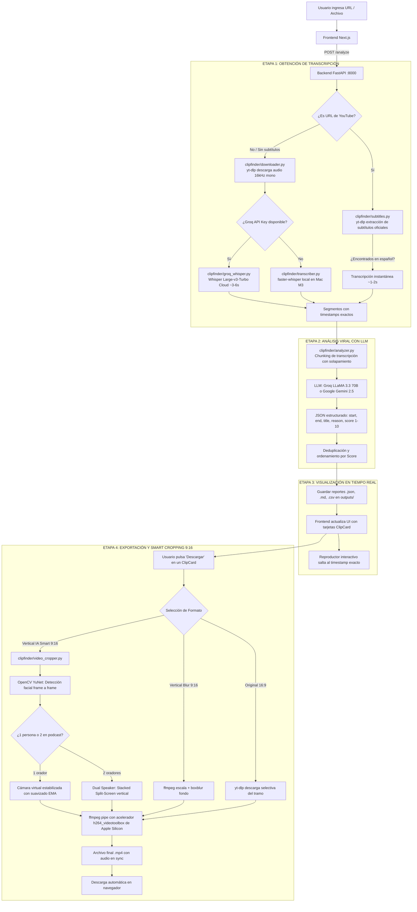

# 🎬 ClipFinder — Arquitectura y Flujo Técnico End-to-End

Este documento detalla el flujo completo de **ClipFinder**, desde que el usuario introduce un enlace de video hasta la generación y descarga del clip recortado en formato vertical inteligente (9:16) con seguimiento facial.

---

## 🗺️ Diagrama General del Flujo



---

## 1. Etapa 1: Ingesta y Obtención de la Transcripción

El objetivo de esta etapa es obtener el texto hablado junto con sus **timestamps exactos** (`start_seconds`, `end_seconds`) con la mínima latencia y consumo de recursos posible.

### Estrategia en Cascada (Waterfall)

ClipFinder implementa una estrategia de 3 niveles de velocidad:

| Nivel | Método | Herramienta | Latencia Típica |
| :--- | :--- | :--- | :--- |
| **Nivel 0 (Instantáneo)** | Subtítulos oficiales de YouTube | `yt-dlp` (`writesubtitles`, `writeautomaticsub`) | **~1 a 2 segundos** |
| **Nivel 1 (Nube Ultrarrápida)** | Whisper Large-v3 en Cloud | Groq API (`whisper-large-v3-turbo`) | **~3 a 6 segundos** |
| **Nivel 2 (Local Autónomo)** | Inferencia local en CPU/GPU | `faster-whisper` (CTranslate2 optimizado) | **~15 a 45 segundos** |

### ¿Cómo lo hace técnicamente?

1. **Subtítulos Oficiales ([subtitles.py](file:///Users/michellmarcospachecotacay/Documents/portafolio/clipfinder/clipfinder/subtitles.py))**:
   - `yt-dlp.YoutubeDL` consulta los metadatos del video con `skip_download=True`.
   - Revisa las pistas de subtítulos manuales y automáticas buscando variantes en español (`es`, `es-419`, `es-MX`, `es-ES`, etc.).
   - Si existen, descarga directamente el formato `json3` de YouTube que ya contiene las palabras y marcas de tiempo exactas por milisegundos. No descarga audio ni video, ahorrando el 100% del ancho de banda.

2. **Descarga de Audio ([downloader.py](file:///Users/michellmarcospachecotacay/Documents/portafolio/clipfinder/clipfinder/downloader.py))**:
   - Si no hay subtítulos disponibles o es un archivo local, `yt-dlp` extrae únicamente el canal de audio y `ffmpeg` lo convierte a `audio.wav` (PCM 16kHz mono), formato óptimo para modelos Whisper.

3. **Whisper en Groq Cloud ([groq_whisper.py](file:///Users/michellmarcospachecotacay/Documents/portafolio/clipfinder/clipfinder/groq_whisper.py))**:
   - Envía el audio al endpoint de Groq acelerado por LPUs (Language Processing Units), devolviendo los segmentos con formato `verbose_json`.

4. **Whisper Local ([transcriber.py](file:///Users/michellmarcospachecotacay/Documents/portafolio/clipfinder/clipfinder/transcriber.py))**:
   - Utiliza `faster-whisper`, que ejecuta una cuantización `float16`/`int8` en los núcleos de rendimiento de Apple Silicon (M3 Pro) aprovechando múltiples hilos.

---

## 2. Etapa 2: Análisis Semántico y Detección Viral con LLM

Una vez generada la lista de segmentos (`TranscriptSegment`), entra en acción el motor de análisis heurístico y LLM ([analyzer.py](file:///Users/michellmarcospachecotacay/Documents/portafolio/clipfinder/clipfinder/analyzer.py)).

### ¿Qué usa?
* **Modelos**:
  * **Groq**: `llama-3.3-70b-versatile` (por defecto) o `llama3-70b-8192`.
  * **Google Gemini**: `gemini-2.5-flash`.
* **Técnica de Chunking**: Para videos largos de 1 a 3 horas que exceden la ventana de contexto ideal, se divide la transcripción en bloques temporales de ~10 a 15 minutos con un **solapamiento (overlap) de 60 segundos** entre bloques para evitar cortar ideas a la mitad.

### ¿Cómo detecta los mejores momentos?
El sistema alimenta al LLM con un **prompt especializado en retención para plataformas cortas** (TikTok, Reels, YouTube Shorts):
1. **Hook (Gancho inicial)**: Los primeros 3 a 5 segundos deben plantear una pregunta intrigante, una revelación sorprendente o una afirmación polémica.
2. **Cuerpo del clip**: Debe tener coherencia narrativa sin requerir contexto externo extenso.
3. **Punchline / Cierre**: Un desenlace claro o una conclusión potente.
4. **Duración objetivo**: Entre 30 y 90 segundos.
5. **Output**: Retorna un esquema JSON estricto:
   ```json
   {
     "start_seconds": 125.4,
     "end_seconds": 182.0,
     "title": "El secreto detrás del algoritmo",
     "reason": "Comienza con una confesión directa y concluye con una métrica impactante.",
     "score": 9.2
   }
   ```
6. **Post-procesamiento**: Se eliminan duplicados temporales y se ordenan por puntuación (`score` de 1 a 10).

---

## 3. Etapa 3: Comunicación en Tiempo Real y Frontend

### ¿Qué usa?
* **Backend**: FastAPI con arquitectura asíncrona no bloqueante (hilos en background para no congelar el servidor).
* **Frontend**: Next.js 16 (App Router) con Turbopack, React y CSS Modules.

### Flujo de Estado:
1. Al enviar la URL, el cliente recibe un `job_id` único (UUIDv4).
2. El frontend realiza sondeos periódicos (polling) cada segundo a `/api/jobs/{jobId}`.
3. Se actualiza una barra de progreso granular con métricas en tiempo real:
   - Porcentaje y velocidad de descarga (MB/s).
   - Cantidad de segmentos de audio transcritos.
   - Bloques analizados por el LLM.
4. Cuando el estado pasa a `done`, se cargan las tarjetas de clips interactuando directamente con el reproductor incrustado de YouTube.

---

## 4. Etapa 4: Recorte de Video, Detección Facial y Formato Vertical (Nivel 3)

Esta es la fase de producción de video integrada en [video_cropper.py](file:///Users/michellmarcospachecotacay/Documents/portafolio/clipfinder/clipfinder/video_cropper.py).

### 1. Extracción Selectiva sin Descarga Completa
En videos de YouTube de 1 o 2 horas, descargar varios gigabytes de video es inviable.
* **Solución**: Se usa `yt-dlp` con la directiva interna `download_ranges(None, [(start_sec, end_sec)])`.
* `yt-dlp` se conecta a los fragmentos HTTP de YouTube y descarga **exclusivamente el rango de segundos del clip** en resolución 1080p con audio AAC.
* Tiempo de extracción: **~1 a 3 segundos**.

### 2. Detección Facial Ultrarrápida con OpenCV YuNet
* Para lograr enfocar a la persona, se utiliza el modelo de red neuronal **YuNet ONNX** (`face_detection_yunet_2023mar.onnx`, 232 KB).
* **Rendimiento**: Se ejecuta nativamente en C++ dentro de OpenCV a **más de 160 FPS** (~6 ms por fotograma en Apple Silicon).
* Detecta en cada cuadro:
  - Posición y tamaño del rostro: `[x, y, w, h]`.
  - Puntos clave: ojos, nariz y comisuras de los labios.
  - Puntuación de confianza (filtrando detecciones `< 0.5`).

### 3. Inteligencia de Encuadre (Nivel 2 y 3)

El sistema analiza los rostros a lo largo del clip y clasifica automáticamente la escena:

#### Caso A: 1 Orador Predominante (Smart Face Tracking)
* Se calcula el centro del rostro en el eje X: $x_{target} = x + w / 2$.
* Para un video 16:9 de $1920 \times 1080$, el ancho necesario para una proporción 9:16 es:
  $$\text{Ancho de recorte} = 1080 \times \frac{9}{16} = 607.5 \approx 608 \text{ píxeles}$$
* **Cámara Virtual Estabilizada (EMA)**:
  Para que la cámara no vibre con cada pequeño parpadeo o movimiento de cabeza del orador, se aplica un suavizado de media móvil exponencial:
  $$x_{cam}(t) = \alpha \cdot x_{target}(t) + (1 - \alpha) \cdot x_{cam}(t-1)$$
  Con $\alpha = 0.08$, la cámara realiza un paneo cinematográfico lento y elegante hacia el orador.

#### Caso B: 2 Oradores en Plano General (Podcast Dual Speaker / Split-Screen)
* Si en más del 30% de los fotogramas se detectan dos rostros separados horizontalmente (anfitrión a la izquierda e invitado a la derecha):
  - **Cuadro Superior (1080x960)**: Recorta centrado en el orador de la izquierda.
  - **Cuadro Inferior (1080x960)**: Recorta centrado en el orador de la derecha.
  - **Unión**: Se combinan verticalmente ($960 + 960 = 1920$ px) formando un video 9:16 perfecto para TikTok, con una línea divisoria sutil en el medio.

#### Caso C: Vertical Blur (Fondo Desenfocado)
* Si el usuario prefiere mantener todo el plano horizontal (ideal para gameplays o diapositivas):
  - Con un filtro `ffmpeg` compuesto:
    ```
    [0:v]scale=1080:1920:force_original_aspect_ratio=increase,crop=1080:1920,boxblur=25:5[bg];
    [0:v]scale=1080:-1[fg];
    [bg][fg]overlay=(W-w)/2:(H-h)/2
    ```
  - El fondo se estira y desenfoca con `boxblur`, mientras el video original se mantiene nítido en el centro.

### 4. Renderizado con Aceleración por Hardware en Mac
* Los fotogramas procesados por OpenCV se transmiten directamente por una tubería de memoria (`pipe stdin`) hacia `ffmpeg` sin escribir archivos temporales gigantes en disco:
  ```bash
  ffmpeg -y -f rawvideo -vcodec rawvideo -s 1080x1920 -pix_fmt bgr24 -r 30 -i - \
         -i clip_original.mp4 -map 0:v -map 1:a -c:v h264_videotoolbox -b:v 6M \
         -c:a aac -shortest salida.mp4
  ```
* **`h264_videotoolbox`**: Utiliza el motor de codificación por hardware dedicado del chip Apple Silicon (M-series), codificando a velocidades de más de 200 FPS con consumo mínimo de batería.
* **Sincronización de Audio**: Mapea directamente el audio original sin desfases (`-shortest`).

---

## 5. Resumen de Tecnologías Empleadas

| Área | Tecnología | Propósito |
| :--- | :--- | :--- |
| **Frontend** | Next.js 16 + React + CSS Modules | Interfaz de usuario, polling en vivo y control de descargas |
| **API Backend** | FastAPI + Uvicorn + Pydantic | Orquestación en background y endpoints REST |
| **Descarga & Streaming** | `yt-dlp` | Extracción de subtítulos y descarga de secciones de tiempo específicas |
| **Motor de Audio/Video** | `ffmpeg` + `h264_videotoolbox` | Corte, conversión 16kHz, filtros de desenfoque y codificación por hardware |
| **Transcripción** | `groq` (Whisper v3) / `faster-whisper` | Conversión de voz a texto con marcas de tiempo |
| **IA Semántica (LLM)** | Groq (LLaMA 3.3 70B) / Gemini Flash | Análisis de retención, hooks y puntuación viral |
| **Visión Artificial** | OpenCV + YuNet Neural Model | Detección facial a 160 FPS, seguimiento de orador y split-screen podcast |
